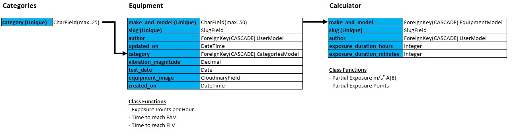

# HAVS|CALC|DB - Database for Risk Assessing Vibration

The live link for the site can be found here - https://havs-calc-db-project.herokuapp.com/

# Table of contents
<!-- - [Design and Planning](#design-and-planning)
  - [Logo Font and Color](#logo-font-and-color)
  - [Error Messages](#error-messages)
  - [Game Process Planning Flow Chart](#game-process-planning-flow-chart)
- [Languages Used](#languages-used)
- [Features](#features)
  - [Existing Features](#existing-features)
    - [Logo and Subtitle](#logo-and-subtitle)
    - [How to Play](#how-to-play)
    - [Select Difficulty](#select-difficulty)
    - [Select Category](#select-category)
    - [Main Game Area](#main-game-area)
    - [Other Features](#other-features)
      - [Guess Answer](#guess-answer)
      - [Adding Game Categories and Answer](#adding-game-categories-and-answers)
  - [Future Features](#future-features)
- [Data Model](#data-model)
  - [Classes and Object Oriented Programming](#classes-and-object-oriented-programming)
- [Testing](#testing)
  - [Test of User Story](#test-of-user-story-game-functionality)
  - [Test on Alternative Browsers](#test-on-alternative-browsers)
  - [Debugging](#debugging)
  - [Validator Testing](#validator-testing)
  - [Unfixed Bugs](#unfixed-bugs)
  - [Libraries and Programs Used](#libraries-and-programs-used)
- [Deployment](#deployment)
- [Credits](#credits)
  - [Content](#content) -->

# Design and Planning

**Site Purpose**

This site was developed to address a problem which occured during my previous employment as a Senior Account Manager for a Health and Safety Consultancy. I did at the time develop this solution in Microsoft Excel at the time but thought that this assignment would be a great oppertunity to create a web version of the application.

The issue was in relation to Hand Arm Vibrations (HAVS). HAVS is a condition caused by exposure of the hands and arms to vibration when using hand held tools. To prevent over exposure to vibration, the Health and Safety Executive created a HAVS Calculator so you could calculate whether an individual would be exposed to a cumilative magnitude above actions levels or limits based upon to tools which were being used during the day and how long they were being used for.

When working for my pervious company, I observed that the companies managers were having difficulty completing this calculator as they found it onerous to get hold of the imformation which they needed to complete it. The company had over 100 peices of equipment in use within the business and all of the vibration magnitude measurements would be stored somewhere on the system where not everyone had access: there were 100s of managers from all parts of the business requiring this information. 

The solution which I came up with was to store all of the required information in a central accessible database which was directly linked to the HAVS Calculator itself.

- Made it quicker
- Easy of use
- Improved selection of equipment. Can choose a tool with a lower magnitude.
- Reduced mistakes from transfering information.
- Improve uptake. Given it was easy to do, more people would do it.
- Management of company equipment. The database provided a central location so they were aware of the tools being used within the business. 

**Personas**

**User Goals**

<!-- May have covered this above? -->

**Wireframes**

**User Stories** 

<!-- Add story Points -->

As there will only be two different types of user of this site (site user and site admin), I have broken down my user stories into these two categories. Not all of the user stories have been implmented but have been left to be included at a later date once the site grows.

Site User:

1. Account Registration: As a **Site User** I can **Register an Account** so that **I can access the system to assess a task with the calculator**.
2. View Calculator: As a **Site User** I can **View the Calulator** so that **I can start to assess the vibration exposure of a new task**.
3. Add Equipment to Calculator: As a **Site User** I can **Add Equipment to a new Project** so that **I can include the equipment being used during a task to then assess the vibration exposure**.
4. Edit Equipment Details in Calculator: As a **Site User** I can **Edit Equipment Details in an Existing Project** so that **I can update equipment details where the duration of use has changed**.
5. Delete Equipment in Calculator: As a **Site User** I can **Delete Equipment in an Existing Project** so that **I can remove equipment which my no longer be used in a task**.
6. Reset Calculator: As a **Site User** I can **Reset Calculator** so that **I can assess a new task**.
7. Calculate Exposure Details: As a **Site User** I can **Calculate Exposure Details** so that **I can assess the overall exposure to vibartion of a task**.
8. View Equipment List: As a **Site User** I can **View the Equipment List** so that **I can ensure the equipment needed for their calculation us available**.
9. View Equipment Details: As a **Site User** I can **View Equipment Details** so that **I can view the exposure limits of various items and decide which equipment is the safest to use**.
10. Equipment Pagination: As a **Site User** I can **View a Paginated List of Equipment** so that **I can easily find equipment and view it's details**.
11. Filter Equipment: As a **Site User** I can **Filter Equipment by Category** so that **it is easier to find the equipment I am looking for - e.g. browsing through the equipment list**.
12. Add Project: As a **Site User** I can **Add a Project** so that **instead of reseting my calculator for a new task, I can create a new project and add to a new calculator (saving ones previously created to go back to)**.

Site Admin:

1. Add equipment: As a **Site Admin** I can **Add Equipment** so that **It is available for a user to included it within a calculator**.
2. Edit Equipment Details: As a **Site Admin** I can **Edit Equipment Details** so that **The most up to date information is available to the user**.
3. Delete Equipment: As a **Site Admin** I can **Delete Equipment** so that **It is no longer available to be used in a calculator**.
4. Add Categories: As a **Site Admin** I can **Add a Category** so that **It is available to be allocated to equipment**.
5. Edit Categories: As a **Site Admin** I can **Edit a Category** so that **The correct category can be allocated to equipment**.
6. Delete Categories: As a **Site Admin** I can **Delete a Category** so that **It is no longer available to be allocated to equipment**.

**Application Flowcharts**

**Data Models/Schema - Classes and Object Oriented Programming**

After initially setting out all of the information required for the site, I used data normalisation to structure each relational model to help reduce data redundancy and improve data integrity.

**Class Functions**

# Languages Used

- HTML
- CSS
- JavaScript
- JQuery
- Python
- Django
- SQL (PostgreSQL: ElephantSQL)

# Features

## Existing Features:

### Logo

### Navigation

<!-- More >>>>>>>>>>>>>> -->

## Other Features:

## Future Features

- Projects
- Filtering by selection
- Equipment PPM Management
- Noise Calculator
- Accessories and Ground Conditions
<!-- More of the above point? -->

# Testing

## Test of User Stories:

| Test   |      Expected     |  Passed |
|--------|:------------------|:--------:|

## Test on Alternative Browsers

<!-- |   Test   |   Layout (Pass)   |   Functionality (Pass)   |
|----------|:-----------------:|:-------------------------:|
|Chrome    |      ☑           |            ☑             |
|Safari    |      ☑           |            ☑             |
|Firefox   |      ☑           |            ☑             |
|Edge      |      ☑           |            ☑             | -->

## Debugging

## Validator Testing

<!-- - PEP8Online: No errors raised in both of the run.py and hangman.py files.

*PEP8 Online Checker: run.py file*

*PEP8 Online Checker: hangman.py file*

- Lighthouse (Accessibility Audit): The page achieved a great accessibility performance.

 -->

## Unfixed Bugs

<!-- There were no unfixed bugs identified during the testing of this site. -->
When adding equipment to the calculator model in the admin site, if the data inserted is exactly the same as what already exists, a validation error will pop-up stating "Calculator with this Slug already exists". 

1. This has been fixed when adding equipment to the calculator model from the live site (most likely the only place this would be added).
2. From a UX perspective, it is unlikely that this error will ever occur as a user would just update the expsoure time of the existing instance, rather than having a duplication.

The solution to fix this on the admin site is for the admin to slightly change the slug themselves and this will then work.

## Libraries and Programs Used

<!-- - Github: Store Repository
- Gitpod: Create the python files
- Google Chrome, Microsoft Edge, Mozilla Firefox, Safari: Site testing on alternative browsers
- Microsoft OneNote: Planning notes for the project
- Am I Responsive: Screenshots of the final project for the README file
- Lucid Charts: Planning the site process with a flow diagram
- Photoshop -->

**Installed Packages**

- 'django<4' gunicorn
- dj3-cloudinary-storage

<!-- Add -->

# Deployment

<!-- This project was deployed on Heroku using Code Institute's Python Essentials template. The steps taken to create the Heroku App were:

**Preparing for deployment on GitHub:**

1. Add a new line character ("\n") after each input request
2. Type into the terminal 'pip3 freeze > requirements.txt' to update this file with a list of dependencies which Heroku needs to download for the application to work

**Deploying on Heroku:**

1. Create App
2. Add creds.json file information to the Apps Config Vars
3. Add the 'Python' and the 'Nodejs' buildpacks
4. Select the GitHub Deployment Method, and confirm the connection to GitHub
5. Search and connect to the Hangman Game GitHub Repository
6. Enable 'Automatic Deploys'
7. Then manually deploy by selecting the 'Deploy Branch' button
8. The app will then be successfully deployed: press the 'view' button to open the deployed site 

The live link for the site can be found here -  -->

# Credits

## Content

Resources Used:

Images:
Atlas Copco Cobra Mk1 -	https://www.google.com/url?sa=i&url=https%3A%2F%2Fwww.forconstructionpros.com%2Fconcrete%2Fequipment-products%2Fproduct%2F12104270%2Fatlas-copco-construction-equipment-atlas-copco-releases-new-versions-of-cobra-proe-and-cobra-tte-gas-breakers&psig=AOvVaw02K3AsISi9o6f2QEAakx5M&ust=1671874761415000&source=images&cd=vfe&ved=0CA8QjRxqFwoTCJD91_24j_wCFQAAAAAdAAAAABAr
Waker BS50-2 -	https://www.google.com/url?sa=i&url=https%3A%2F%2Fwww.expresstools.co.uk%2Fwacker-neuson-bs50-2-trench-363924.html&psig=AOvVaw0nXF9Pj51CtTgWEkd_gcyc&ust=1671874852756000&source=images&cd=vfe&ved=0CA8QjRxqFwoTCNiKm6m5j_wCFQAAAAAdAAAAABAE
Bomag BVP18/45 -	https://www.acmetools.com/177-in-single-direction-vibratory-plate-honda-gx160-engine-bvp-18-45/402000002747.html
Husqvarna LG164 -	https://www.nixonhire.co.uk/sales/p/plate-compactor-husqvarna-lg164
Waker BPS1030A -	https://tjcplant.co.uk/product/wacker-neuson-single-direction-vibratory-plate-bps1030a/
Makita DDF481 -	https://www.idealo.co.uk/compare/5659819/makita-ddf481.html
Hycon HCD50-200 -	https://dtwtools.co.uk/product/hycon-hcd50-200-core-drill/
Makita BHR202 -	https://www.amazon.co.uk/Makita-DHR202-Naked-Rotary-Hammer/dp/B001EYUQP0
Makita HR2630 -	https://www.reevoo.com/p/makita-hr2630-rotary-hammer-sds-26mm-rotary-hammer-drill-3-mode-26mm-with-accessories-240v
Milwaukee M12CH -	https://www.toolstop.co.uk/milwaukee-m12ch-0-fuel-brushless-sds-hammer-drill-body-only/
Milwaukee M18CHX -	https://www.powertoolmate.co.uk/power-tools/milwaukee/cordless-sds-drills/milwaukee-m18chx-0-m18-fuel-18v-sds-plus-hammer-drill-bare-unit.htm
Makita DGA452 -	https://www.protrade.co.uk/product/makita-dga452-lxt-18v-115mm-angle-grinder-c-w-2-x-5-0ah-batt/
Mecalac MBR71 -	https://www.mecalac.com/en/news-and-press/mecalac-completely-redesigns-its-mbr71-single-drum-compaction-roller.html
Fein AMM500 -	https://www.machinemart.co.uk/p/fein-cordless-multimaster-amm-500-plus-select-/
Stihl MS181C -	https://www.radmoretucker.co.uk/shop/garden-machinery/chainsaws-tree-care/petrol-chainsaws/stihl-ms-181-c-be-petrol-chainsaw/
Stihl MS362C -	https://honeybros.com/shop/machinery/chainsaws/petrol-chainsaws/forestry-petrol-chainsaws/stihl-ms-362-c-m-chainsaw/
Stihl MSA 200C -	https://shop.stihl.co.uk/products/msa-200-c-b-cordless-chainsaw
Belle Duo 350X -	https://www.toolstoday.co.uk/belle-duo-350x-petrol-twin-blade-floor-saw
Belle Ranger 450 -	https://www.machinemart.co.uk/p/altrad-belle-ranger-450-lombardini-floor-saw/
Bosch GST150BCE -	https://www.toolstop.co.uk/bosch-gst150bce-150mm-780w-bow-handle-jigsaw-110v-p12559/
Makita DTW190 -	https://www.tooled-up.com/makita-dtw190-18v-cordless-lxt-1-2-drive-impact-wrench/prod/291078/

