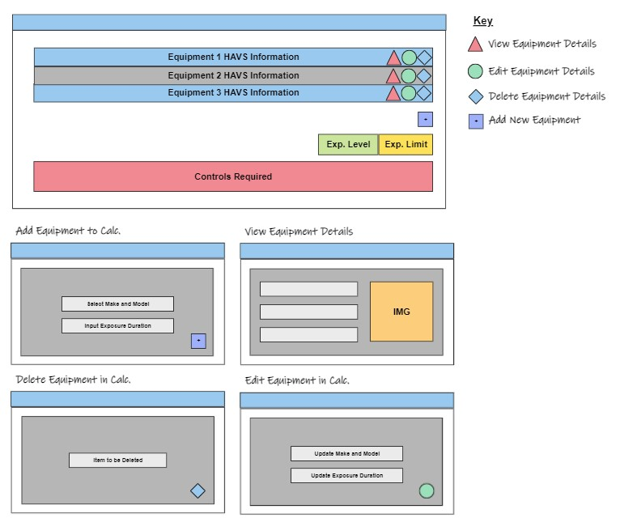

# HAVS|CALC|DB - Database for Risk Assessing Vibration

The live link for the site can be found here - https://havs-calc-db-project.herokuapp.com/

# Table of Contents
<!-- - [Design and Planning](#design-and-planning)
  - [Logo Font and Color](#logo-font-and-color)
  - [Error Messages](#error-messages)
  - [Game Process Planning Flow Chart](#game-process-planning-flow-chart)
- [Languages Used](#languages-used)
- [Features](#features)
  - [Existing Features](#existing-features)
    - [Logo and Subtitle](#logo-and-subtitle)
    - [How to Play](#how-to-play)
    - [Select Difficulty](#select-difficulty)
    - [Select Category](#select-category)
    - [Main Game Area](#main-game-area)
    - [Other Features](#other-features)
      - [Guess Answer](#guess-answer)
      - [Adding Game Categories and Answer](#adding-game-categories-and-answers)
  - [Future Features](#future-features)
- [Data Model](#data-model)
  - [Classes and Object Oriented Programming](#classes-and-object-oriented-programming)
- [Testing](#testing)
  - [Test of User Story](#test-of-user-story-game-functionality)
  - [Test on Alternative Browsers](#test-on-alternative-browsers)
  - [Debugging](#debugging)
  - [Validator Testing](#validator-testing)
  - [Unfixed Bugs](#unfixed-bugs)
  - [Libraries and Programs Used](#libraries-and-programs-used)
- [Deployment](#deployment)
- [Credits](#credits)
  - [Content](#content) -->

# Design and Planning

**Site Purpose and User Goals**

This site was developed to address a problem which occured during my previous employment as a Senior Account Manager for a Health and Safety Consultancy. I did at the time develop this solution in Microsoft Excel at the time but thought that this assignment would be a great oppertunity to create a web version of the application.

The issue was in relation to Hand Arm Vibrations (HAVS). HAVS is a condition caused by exposure of the hands and arms to vibration when using hand held tools. To prevent over exposure to vibration, the Health and Safety Executive created a HAVS Calculator so you could calculate whether an individual would be exposed to a cumilative magnitude above actions levels or limits based upon to tools which were being used during the day and how long they were being used for.

When working for my pervious company, I observed that the companies managers were having difficulty completing this calculator as they found it onerous to get hold of the imformation which they needed to complete it. The company had over 100 peices of equipment in use within the business and all of the vibration magnitude measurements would be stored somewhere on the system where not everyone had access: there were 100s of managers from all parts of the business requiring this information. 

The solution which I came up with was to store all of the required information in a central accessible database which was directly linked to the HAVS Calculator itself.

<!-- TBC -->

- Made it quicker
- Easy of use
- Improved selection of equipment. Can choose a tool with a lower magnitude.
- Reduced mistakes from transfering information.
- Improve uptake. Given it was easy to do, more people would do it.
- Management of company equipment. The database provided a central location so they were aware of the tools being used within the business. 

**Personas**

<!-- TBC -->

*Site User*

*Site Admin*

**User Stories** 

<!-- Add story Points -->

As there will only be two different types of user of this site (site user and site admin), I have broken down my user stories into these two categories. Not all of the user stories have been implmented but have been left to be included at a later date once the site grows.

*As a Site User:*

1. **Account Registration**: I can Register an Account so that I can access the system to assess a task with the calculator.
2. **View Calculator**: I can View the Calulator so that I can start to assess the vibration exposure of a new task.
3. **Add Equipment to Calculator**: I can Add Equipment to a new Project so that I can include the equipment being used during a task to then assess the vibration exposure.
4. **Edit Equipment Details in Calculator**: I can Edit Equipment Details in an Existing Project so that I can update equipment details where the duration of use has changed.
5. **Delete Equipment in Calculator**: I can Delete Equipment in an Existing Project so that I can remove equipment which my no longer be used in a task.
6. **Reset Calculator**: I can Reset Calculator so that I can assess a new task.
7. **Calculate Exposure Details**: I can Calculate Exposure Details so that I can assess the overall exposure to vibartion of a task.
8. **View Equipment List**: I can View the Equipment List so that I can ensure the equipment needed for their calculation us available.
9. **View Equipment Details**: I can View Equipment Details so that I can view the exposure limits of various items and decide which equipment is the safest to use.
10. **Equipment Pagination**: I can View a Paginated List of Equipment so that I can easily find equipment and view it's details.
11. **Filter Equipment**: I can Filter Equipment by Category so that it is easier to find the equipment I am looking for - e.g. browsing through the equipment list.
12. **Add Project**: I can Add a Project so that instead of reseting my calculator for a new task, I can create a new project and add to a new calculator (saving ones previously created to go back to).

*As a Site Admin:*

1. **Add equipment**: I can Add Equipment so that It is available for a user to included it within a calculator.
2. **Edit Equipment Details**: I can Edit Equipment Details so that The most up to date information is available to the user.
3. **Delete Equipment**: I can Delete Equipment so that It is no longer available to be used in a calculator.
4. **Add Categories**: I can Add a Category so that It is available to be allocated to equipment.
5. **Edit Categories**: I can Edit a Category so that The correct category can be allocated to equipment.
6. **Delete Categories**: I can Delete a Category so that It is no longer available to be allocated to equipment.

**Wireframes**

*Index Page*

*Logged in User Navbar*

*Calculator Pages*

*Equipment Pages*

**Site Navigation Flowchart**

**Data Models/Schema - Classes and Object Oriented Programming**

After initially setting out all of the information required for the site, I used data normalisation to structure each relational model to help reduce data redundancy and improve data integrity.

*Class Functions*

To further improve data integrity, I decided to create class functions which calculated data values rather than storing this information in each model. As the user was able to update instances within the models which the outcome of the class function calculations were dependant on, keeping these seperate from the model meant that only one instance within the model required updating.

# Languages Used

- HTML
- CSS
- JavaScript
- JQuery
- Python
- Django
- SQL (PostgreSQL)

# Features

## Existing Features:

### Home Page

<!-- TBC Once the final design of the site has been confirmed -->

### Logo

### Navigation

*User - Logged Out*

*User - Logged In*

*Mobile*

### Footer

### Calculator

- Calculator Button

### Equipment

**View Equipment Details**

## Other Features:

<!-- TBC -->

- Logging In with AllAuth
- User is informed when they have logged in

## Future Features

<!-- TBC -->

- **Add Projects:** As a Site User I can Add a Project so that instead of reseting my calculator for a new task, I can create a new project and add to a new calculator (saving ones previously created to go back to).
- **Filtering by Category:** As a Site User I can Filter Equipment by Category so that it is easier to find the equipment I am looking for - e.g. browsing through the equipment list.
- **Equipment Planned Preventative Maintenance (PPM) Management:**
- **Noise Calculator:**
- **Add and Filter by Accessories and Ground Conditions:**

# Testing

## Manual Test of User Stories:

***As a Site User:***

| Test   |      Expected     |  Passed |
|-------|:------------------|:--------:|
|I can Register an Account so that I can access the system to assess a task with the calculator.|- User is able to login - User is able to logout - User is able to register for an account|☑|
|I can View the Calulator so that I can start to assess the vibration exposure of a new task.|- The user is able to view their own calculator  - The calculator should be blank if they have not added any equipment previously - The calculator should display any previously added equipment|☑|
|I can Add Equipment to a new Project so that I can include the equipment being used during a task to then assess the vibration exposure.|- Button should be available for the user to add equipment to their own calculator - Form is displayed requesting the user to add their information - The form includes validation to ensure it has been completed and no invalid values have been input - Submit button is available for the user to confirm their addition - Details of the equipment added should be included into the users calculator|☑|
|I can View Calculator Equipment Details so that I can view the partial exposure limits of the item.|- Button is available for each equipment instance in the calculator to view more details of that item - Once the button is clicked, the correct details of the equipment selected are displayed - The information which should be displayed on the details page is:     a. Category - Make and Model     b. Vibration Magnitude     c. Exposure Duration     d. Exposure Points per Hour     e. Time to reach EAV     f. Time to reach ELV     g. Partial Exposure     h. Partial Exposure Points     i. An image of the equipment (or placeholder image) - A 'Back' button should also be available on the details page so the user can return to the calculator|☑|
|I can Edit Equipment Details in an Existing Project so that I can update equipment details where the duration of use has changed.|- Button is available for the user to click when they want to edit a calculator equipment instance - The correct details of the selected instance are displayed - These details can be edited by the user - A submit button is available for the user to confirm any changes made - The edited instance in the user's calculator has been updated|☑|
|I can Delete Equipment in an Existing Project so that I can remove equipment which my no longer be used in a task.|- Button is available for the user to click when they want to delete a calculator equipment instance - The correct details of the selected instance are displayed - A submit button is available for the user to confirm they want to delete - A cancel button is available if they do not want to delete - The deleted instance in the user's calculator has been removed|☑|
|I can Reset Calculator so that I can assess a new task.|- Button is available for the user to click when they want to reset their calculator - Once the button has been seleted, all of the instances in the user's calculator have been removed|☑|
|I can Calculate Exposure Details so that I can assess the overall exposure to vibartion of a task.|- The following fields are calculated and displayed in the user's calculator:     a. Exposure Points per Hour     b. Time to reach EAV     c. Time to reach ELV     d. Partial Exposure     e. Partial Exposure Points - Button is available on the user's calculator to click when they want to calculate the overall exposure - Once the button has been clicked, the calculator updates the following fields:     a. Daily Exposure     b. Total Exposure Points     c. Exposure Warning     d. EAV/ELV Specific Control Measures to Consider|☑|
|I can View the Equipment List so that I can ensure the equipment needed for their calculation us available.|- The user is able to view a list of all of the equipment in the database - This list should display an image (or placeholder image) of the equipment and detail the category and Make and Model of the item|☑|
|I can View Equipment Details so that I can view the exposure limits of various items and decide which equipment is the safest to use.|- Button is available for each item on the Equipment List to view more details of that item - Once the button is clicked, the correct details of the equipment selected are displayed - The information which should be displayed on the details page is:     a. Category - Make and Model     b. Vibration Magnitude     c. Exposure Points per Hour     d. Time to reach EAV     e. Time to reach ELV     f. Date Tested     g. Date Added     h. Name of the user the equipment was added by     i. An image of the equipment (or placeholder image) - A 'Back' button should also be available on the details page so the user can return to the equipment list|☑|
|I can view a paginated list of equipment so that I can easily find equipment and view it's details.|- User is able to cycle through a list of equipment - User is able to view a previous page of equipment - User is limited to six items of equipment per page|☑|

***As a Site Admin:***

| Test   |      Expected     |  Passed |
|--------|:------------------|:--------:|
|I can Add Equipment so that It is available for a user to included it within a calculator.|- The site admin is able to log into the django app site admin page - Equipment has been registered on this page and is available to select once logged in - Once on the equipment list on the admin site, an 'add equipment' button is available - A form is displayed requesting the admin to add the equipments information - The form includes validation to ensure it has been completed and no invalid values have been input - Save button is available for the admin to confirm their addition - Details of the equipment added should be included into the admins site equipment list and the websites equipment list|☑|
|I can Edit Equipment Details so that The most up to date information is available to the user.|- Button is available for the admin to click when they want to edit an equipment instance - The correct details of the selected instance are displayed - These details can be edited by the admin - A save button is available for the admin to confirm any changes made - The instance of the equipment edited should be updated the admins site equipment list and the websites equipment list|☑|
|I can Delete Equipment so that It is no longer available to be used in a calculator.|- Button is available for the admin to click when they want to delete an equipment instance - The deleted instance of the equipment should be removed the admins site equipment list and the websites equipment list|☑|
|I can Add a Category so that It is available to be allocated to equipment.|- The site admin is able to log into the django app site admin page - Categories has been registered on this page and is available to select once logged in - Once on the categories list on the admin site, an 'add category' button is available - A form is displayed requesting the admin to add the category - The form includes validation to ensure it has been completed and no invalid values have been input - Save button is available for the admin to confirm their addition - The category added should be included into the admins site category list and should be available to select when equipment is being added|☑|
|I can Edit a Category so that The correct category can be allocated to equipment.|- Button is available for the admin to click when they want to edit a category instance - The correct details of the selected instance are displayed - These details can be edited by the admin - A save button is available for the admin to confirm any changes made - The instance of the category edited should be updated the admins site categories list and should be available to select when equipment is being added|☑|
|I can Delete a Category so that It is no longer available to be allocated to equipment.|- Button is available for the admin to click when they want to delete a category instance - The deleted instance of the category should be removed the admins site category list and should not be available to be selected when equipment is being added|☑|

## Test on Alternative Browsers and Screen Size

|   Test   |   Small (≥576px) |  Medium (≥768px)   |   Large (≥992px)   |   Functionality (Pass)   |
|----------|:----------------:|:------------------:|:------------------:|:------------------------:|
|Chrome    |      ☑           |         ☑         |         ☑         |            ☑             |
|Safari    |      ☑           |         ☑         |         ☑         |            ☑             |
|Firefox   |      ☑           |         ☑         |         ☑         |            ☑             |
|Edge      |      ☑           |         ☑         |         ☑         |            ☑             |

## Debugging

1. Placeholder Image on Equipment/Calculator Detail Pages

The placeholder images on the equipment and calculator detail pages were not displaying.

It is noted that the correct "alt" text was being displayed in the images place so it was thought that the if statement in the code is working.

It is also noted that the cloudinary images were being displayed.

*To Reproduce*
Steps to reproduce the behavior:

a. Go to 'https://havs-calc-db-pp4.herokuapp.com/equipment/'
b. Click on 'View Details' of an equipment with a placeholder image in list view
c. See error: Alt text displaying instead of the placeholder image

*Expected behavior*
A placeholder image was to be displayed in the equipment and calculator detail pages where a user has not uploaded an image.

*Solution*
A source link to the folder location was being used instead of reference to the static file location, e.g. 

2. Text formatting of EAV/ELV Specific Control Measures

There was an issue with the text formatting of the reponses under "EAV/ELV Specific Control Measures".

*To Reproduce*
Steps to reproduce the behavior:

a. Go to 'https://8000-tuckerfaulk-havscalcdbp-zn557uvrtgy.ws-eu82.gitpod.io/calculator/'
b. Click on 'Calculate Daily Exposure'
c. See error: text incorrectly formatted under "EAV/ELV Specific Control Measures"

*Expected behavior*
Bullet points were expected to be set on a new line. All of the text was bunching into a single paragraph.

*Solution*
In the JavaScript function set to add the appropriate response once the 'Calculate Daily Exposure' button is selected, the code was written to only replace the "text" in the html tag. This was changed so the "html" is to be replaced and the response variables were updated to include html formatting.

3. Calculator Slug

If a user tried to add equipment to their calculator which is the same make and model and exposure duration of an instance already existing in the calculator, an error was displayed as a unique slug could not be created.

*To Reproduce*
Steps to reproduce the behavior:

a. Go to 'https://8000-tuckerfaulk-havscalcdbp-zn557uvrtgy.ws-eu82.gitpod.io/calculator/'
b. Click on 'Add Equipment'
c. Add equipment noting the "make and model" and "exposure duration" detailed
d. Submit form
e. Click on 'Add Equipment' again
f. Add equipment again but insert the same "make and model" and "exposure duration" previously detailed
g. Submit form
h. See error

*Expected behavior*
Once a form is submitted, the new equipment should be displayed in the calculator even if this is a duplication of what has already been added.

*Solution*
The error was being displayed as a unique slug could not be generated. The slug was being created based on the user, make and model, and exposure duration. As these were all the same when a duplication was submitted, the error was created. Code was added to the slug generator to add five random letters to the end. This ensures that each slug is unique.

## Validator Testing

<!-- TBC Once the site has been finalised-->

<!-- - PEP8Online: No errors raised in both of the run.py and hangman.py files.

*PEP8 Online Checker: run.py file*

*PEP8 Online Checker: hangman.py file*

- Lighthouse (Accessibility Audit): The page achieved a great accessibility performance.

 -->

## Unfixed Bugs

When adding equipment to the calculator model in the admin site, if the data inserted is exactly the same as what already exists, a validation error will pop-up stating "Calculator with this Slug already exists". 

1. This has been fixed when adding equipment to the calculator model from the live site (most likely the only place this would be added).
2. From a UX perspective, it is unlikely that this error will ever occur as a user would just update the expsoure time of the existing instance, rather than having a duplication.

The solution to fix this on the admin site is for the admin to slightly change the slug themselves and this will then work.

## Libraries and Programs Used

- Github: Store Repository
- Gitpod: IDE
- Heroku: Site Deployment
- Cloudinary: Serving static media files
- ElephantSQL: PostgreSQL database hosting
- Google Chrome, Microsoft Edge, Mozilla Firefox, Safari: Site testing on alternative browsers
- Microsoft OneNote: Planning notes for the project
- Microsoft Whiteboard: Developing wireframes
- Am I Responsive: Screenshots of the final project for the README file
- Lucid Charts: Planning the site process with a flow diagram
- Adobe Photoshop: Photo editing
- Bootstrap: CSS Styling
- Google Fonts: for the font families
- Font Awesome: to add icons to the site

**Installed Packages**

- Cloudinary (1.30.0)
- Dj-database-url (0.5.0)
- Django (3.2.16)
- Django-allauth (0.51.0)
- Django-crispy-forms (1.14.0)
- Gunicorn (20.1.0)
- Psycopg2 (2.9.5)

# Deployment

<!-- TBC -->

This project was deployed on Heroku using Code Institute's I Think Therefore I Blog Videos. The steps taken to create the Heroku App were:

**Installing Libraries:**

**Creating the Heroku App:**

**Creating the PostgreSQL database (ElephantSQL):**

**Hiding Sensivite Information:**

**Update Settings:**

**Connecting Heroku to the Database:**

**Connecting Cloudinary:**

**Allowing Heroku as Host:**

# Credits

I have again enjoyed learning with the Code Institute and completing my four assignment. I would like to thank my mentor Martina for her support, the CI Student Support Team and the CI Slack Community. Finally a big thank you to my girlfriend and little sister for their help with testing and the review of this site.

## Content

Resources Used:

- Code Institutes 'I Think Therefore I Blog Videos'
- @Ed B_alum CI Project-Portfolio-4 Slack Channel - Filtering each Calculator to only Display the Logged in Users Equipment
- [Support with Data Normalisation](https://www.youtube.com/watch?v=GFQaEYEc8_8)
- [Creating the Vibration Calculations](https://www.hse.gov.uk/pubns/priced/l140.pdf)
- [Index Page Information](https://www.twi-global.com/technical-knowledge/faqs/faq-what-is-hand-arm-vibration-syndrome-havs)
- [Django Secret Key Generator](https://miniwebtool.com/django-secret-key-generator/)
- [Creating a Random String in Slug](https://stackoverflow.com/questions/42429463/django-generating-random-unique-slug-field-for-each-model-object)
- [Setting the logged in user to created_by for Django Views](https://stackoverflow.com/questions/72033344/set-the-logged-in-user-to-created-by-for-django-createview)
- [Very Academy YouTube Channel - Django Class-Based Views Playlist](https://www.youtube.com/watch?v=GxA2I-n8NR8&list=PLOLrQ9Pn6caxNb9eFZJ6LfY29nZkKmmXT)
- [Creating Slugs in Models](https://github.com/veryacademy/YT-Django-CBV-Mini-Series/blob/master/CreateView/books/models.py)
- [Calculator Reset Button - Deleteing all instances from a Django Model](https://www.codegrepper.com/tpc/how+to+delete+all+instances+of+model+in+django)
- [Hamburger Navbar](https://mdbootstrap.com/docs/b4/jquery/navigation/hamburger-menu/)

**Images**

*Jumbotron Image*

- [Jackhammer](https://www.istockphoto.com/photo/working-on-a-road-construction-gm164526286-23495173)

*For Equipment in the Equipment List:*

- [Atlas Copco Cobra Mk1](https://www.google.com/url?sa=i&url=https%3A%2F%2Fwww.forconstructionpros.com%2Fconcrete%2Fequipment-products%2Fproduct%2F12104270%2Fatlas-copco-construction-equipment-atlas-copco-releases-new-versions-of-cobra-proe-and-cobra-tte-gas-breakers&psig=AOvVaw02K3AsISi9o6f2QEAakx5M&ust=1671874761415000&source=images&cd=vfe&ved=0CA8QjRxqFwoTCJD91_24j_wCFQAAAAAdAAAAABAr)
- [Waker BS50-2](https://www.google.com/url?sa=i&url=https%3A%2F%2Fwww.expresstools.co.uk%2Fwacker-neuson-bs50-2-trench-363924.html&psig=AOvVaw0nXF9Pj51CtTgWEkd_gcyc&ust=1671874852756000&source=images&cd=vfe&ved=0CA8QjRxqFwoTCNiKm6m5j_wCFQAAAAAdAAAAABAE)
- [Bomag BVP18/45](https://www.acmetools.com/177-in-single-direction-vibratory-plate-honda-gx160-engine-bvp-18-45/402000002747.html)
- [Husqvarna LG164](https://www.nixonhire.co.uk/sales/p/plate-compactor-husqvarna-lg164)
- [Waker BPS1030A](https://tjcplant.co.uk/product/wacker-neuson-single-direction-vibratory-plate-bps1030a/)
- [Makita DDF481](https://www.idealo.co.uk/compare/5659819/makita-ddf481.html)
- [Hycon HCD50-200](https://dtwtools.co.uk/product/hycon-hcd50-200-core-drill/)
- [Makita BHR202](https://www.amazon.co.uk/Makita-DHR202-Naked-Rotary-Hammer/dp/B001EYUQP0)
- [Makita HR2630](https://www.reevoo.com/p/makita-hr2630-rotary-hammer-sds-26mm-rotary-hammer-drill-3-mode-26mm-with-accessories-240v)
- [Milwaukee M12CH](https://www.toolstop.co.uk/milwaukee-m12ch-0-fuel-brushless-sds-hammer-drill-body-only/)
- [Milwaukee M18CHX](https://www.powertoolmate.co.uk/power-tools/milwaukee/cordless-sds-drills/milwaukee-m18chx-0-m18-fuel-18v-sds-plus-hammer-drill-bare-unit.htm)
- [Makita DGA452](https://www.protrade.co.uk/product/makita-dga452-lxt-18v-115mm-angle-grinder-c-w-2-x-5-0ah-batt/)
- [Mecalac MBR71](https://www.mecalac.com/en/news-and-press/mecalac-completely-redesigns-its-mbr71-single-drum-compaction-roller.html)
- [Fein AMM500](https://www.machinemart.co.uk/p/fein-cordless-multimaster-amm-500-plus-select-/)
- [Stihl MS181C](https://www.radmoretucker.co.uk/shop/garden-machinery/chainsaws-tree-care/petrol-chainsaws/stihl-ms-181-c-be-petrol-chainsaw/)
- [Stihl MS362C](https://honeybros.com/shop/machinery/chainsaws/petrol-chainsaws/forestry-petrol-chainsaws/stihl-ms-362-c-m-chainsaw/)
- [Stihl MSA 200C](https://shop.stihl.co.uk/products/msa-200-c-b-cordless-chainsaw)
- [Belle Duo 350X](https://www.toolstoday.co.uk/belle-duo-350x-petrol-twin-blade-floor-saw)
- [Belle Ranger 450](https://www.machinemart.co.uk/p/altrad-belle-ranger-450-lombardini-floor-saw/)
- [Bosch GST150BCE](https://www.toolstop.co.uk/bosch-gst150bce-150mm-780w-bow-handle-jigsaw-110v-p12559/)
- [Makita DTW190](https://www.tooled-up.com/makita-dtw190-18v-cordless-lxt-1-2-drive-impact-wrench/prod/291078/)
